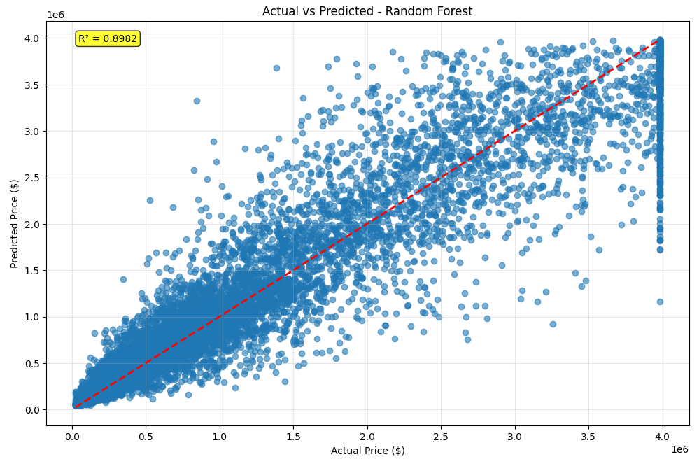

# 🏠 End-to-End House Price Prediction Project

### Created by: Arya Dasgupta

This repository contains an end-to-end machine learning project for predicting house prices. The project includes a full data preprocessing pipeline, training and evaluation of multiple regression models, and an interactive web application built with Streamlit for live predictions.

## ✨ Features
- **Comprehensive Data Preprocessing:** Handles missing values, detects and treats outliers, and performs feature engineering.
- **Multiple Model Training:** Trains and evaluates 6 different regression models: Linear Regression, Ridge, Lasso, Decision Tree, K-Nearest Neighbors, and Random Forest.
- **In-Depth Model Evaluation:** Compares models using R², MAE, and RMSE, and analyzes residuals to diagnose performance.
- **Interactive Web App:** A user-friendly interface powered by Streamlit (`app.py`) to interact with the best-performing model.
- **Reproducible Pipeline:** A complete training script (`train_model.py`) to regenerate models and preprocessing artifacts.

## ⚙️ Project Workflow

The project follows a standard machine learning workflow, from data exploration to model deployment. The key steps are visualized below.

### 1. Exploratory Data Analysis (EDA)

The first step was to understand the dataset, identify issues like missing data, and analyze the relationships between features.

**Missing Data Analysis**
The project began by identifying missing values across the dataset. The heatmap below shows that several columns, including `Bathrooms` and `YearBuilt`, had missing entries.
*Image showing initial missing data heatmap*


**Target Variable Distribution**
Analyzing the `Price` variable revealed a right-skewed distribution, indicating a higher concentration of lower-priced properties and a long tail of expensive ones. This skew is confirmed by the significant difference between the mean and the median price.
*Image of price distribution histogram and boxplot*


**Feature Correlation**
A correlation heatmap was used to understand the relationships between numeric features. As expected, `Area`, `Bedrooms`, and `Bathrooms` show a strong positive correlation with `Price`.
*Image showing correlation heatmap of numeric features*


Scatter plots provided a clearer view of the strong linear relationships between key features and the final price.
*Image of scatter plots showing feature-price relationships*


### 2. Data Preprocessing

To prepare the data for modeling, several preprocessing steps were taken.

**Missing Value Imputation**
Missing values in numerical columns were filled using the median, while categorical columns were filled with the mode. The visualizations below show the data distribution before and after this imputation.
*Image showing histograms before and after missing value imputation*


**Outlier Treatment**
Boxplots revealed a significant number of outliers in features like `Area` and `Price`. These were treated by capping the extreme values at 1.5 times the interquartile range, which helped normalize the distributions and reduce the standard deviation.
*Image showing boxplots before and after outlier treatment*


### 3. Model Training and Evaluation

Six different regression models were trained and evaluated to find the best performer for this dataset.

**Model Performance Comparison**
The models were compared based on R² score, Mean Absolute Error (MAE), and Root Mean Squared Error (RMSE). The Random Forest model emerged as the clear winner, achieving the highest Test R² score (0.898) and the lowest error metrics.
*Image showing bar charts of model performance metrics*


**Actual vs. Predicted Values**
A scatter plot of the actual vs. predicted prices for the Random Forest model shows that the predictions are closely aligned with the actual values, visually confirming the high R² score of 0.8982.
*Image showing a scatter plot of actual vs. predicted values for the best model*


### 4. Model Diagnostics and Interpretation

Further analysis was conducted to ensure the model's reliability and to understand its decision-making process.

**Residual Analysis**
Residual plots were generated for all models to check for patterns in the errors. The Random Forest model displayed the most randomly scattered residuals around the zero line, indicating it is a good fit for the data and does not suffer from issues like heteroscedasticity seen in the linear models.
*Image showing residual plots for all trained models*


**Feature Importance**
To understand which features the models found most predictive, feature importance was analyzed.

- **Random Forest:** The Random Forest model identified `Area` as the most critical feature by a large margin, followed by `Bathrooms` and `Condition`.
*Image showing feature importance from the Random Forest model*


- **Linear Models:** An analysis of coefficients from the linear models also highlighted `Area` as a key predictor. This view also shows how regularization techniques (Ridge and Lasso) shrink coefficients to prevent overfitting.
*Image showing regression coefficients for different linear models*


## 🚀 How to Run

1.  **Clone the repository:**
    ```bash
    git clone [https://github.com/AryaXDG/house-price-prediction.git](https://github.com/AryaXDG/house-price-prediction.git)
    cd house-price-prediction
    ```

2.  **Install dependencies:**
    ```bash
    pip install -r requirements.txt
    ```

3.  **Run the ML pipeline to train models:**
    *(This will generate the `saved_models` directory and the analysis images).*
    ```bash
    python train_model.py
    ```

4.  **Run the Streamlit app:**
    ```bash
    streamlit run app.py
    ```
    Navigate to the local URL provided to use the interactive prediction app.

## 🛠️ Tech Stack
- **Python**
- **Pandas & NumPy** for data manipulation
- **Matplotlib & Seaborn** for data visualization
- **Scikit-learn** for modeling and evaluation
- **Streamlit** for the interactive web application